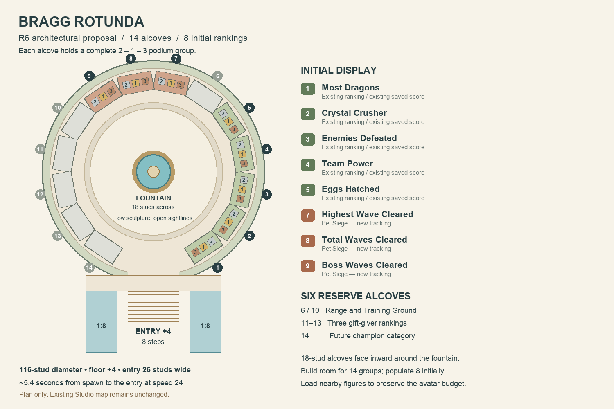

# Bragg Rotunda and Pet Siege rankings — R6 proposal

2026-09-08. **Design only:** no new production tracking, ranking, awards, or Studio geometry is enabled by this document. Gate artwork remains accepted. This is the specification for the next implementation pass.

## Layout

Replace the straight four-bay Champions gallery with an open circular court. Build capacity for **14 ranking alcoves**, each containing a complete **2 / 1 / 3** podium group. Populate eight initially. Reserved bays can hold planting and relief art until their displays are ready; avoid empty anonymous podiums or invented winners.

- Court center X=0/Z=-88, radius 58 (116-stud diameter), floor +4. Rear edge Z=-146 stays within the 360 × 320 island proposal.
- Sixteen angular positions, with two front positions omitted for entry. Fourteen 18 × 10 alcoves face inward around a 47-stud radius.
- Central fountain: 18-stud diameter, sculptural height at most 8 above the court. A low halo-and-horns composition, separate water jets and a shallow basin keep views across the court open.
- Main entrance: 26 studs wide, eight 0.5-stud risers with 2-stud treads. Two flanking 16-wide ramps rise 4 over a run of 32. A common raised entry apron connects both ramps to the opening without passing through a podium alcove.
- The apron extends X=±35, Z=-34 to -26. Central stairs descend toward Z=-10; flanking ramps descend toward Z=6. These are provisional authoring coordinates, not play-tested measurements.
- Court uses real raised terrain and vertical stone retaining faces. Cut the front openings for the stairs/ramps. Redraw the existing rear planting transition around the circle; do not leave the old rectangular terrace underneath.
- Move the current placeholder central landmark into the Bragg fountain composition, freeing the main approach. Keep the accepted gate positions, doorway sizes, and short spawn-to-gate routes.
- Spawn to the circular opening is approximately 130 studs, 5.4 seconds at speed 24 before steering/acceleration. Visitors can choose a game without visiting Bragg.
- The fountain and open entry frame the rear Siege champions. Each alcove uses an architectural header, visible category icon and readable physical name plates. Keep the dancing winner figures, podium order, and board identifiers consistent with the existing system.

Machine-readable proposal: `configs/realm_crossroads_bragg_plan.json`. Drawing: `tools/realm_crossroads/draw_bragg_plan.py` → `output/realm_crossroads/Bragg-Rotunda-R6-Plan.png`.

## Initial categories and expansion

| Category | Why it belongs | Current state |
| --- | --- | --- |
| Most Dragons | Collection achievement | Existing board and podium rules |
| Crystal Crusher | Farming achievement | Existing board and podium rules |
| Enemies Defeated | Meaningful Farm & Fight combat | Existing board and podium rules; do not mix automatic Siege kills into it |
| Team Power | Shared pet progression | Existing strongest-legal-squad ranking |
| Eggs Hatched | Collection effort across the game | Existing published backend; needs physical podium binding |
| Highest Wave Cleared | Flagship Siege achievement | New cleared-wave record required |
| Total Waves Cleared | Sustained Siege play | New durable lifetime counter required |
| Boss Waves Cleared | Successful major encounters | New durable lifetime counter required |

Reserve six bays for Range, Training Ground, the three gift-giver rankings, and a future category. Their existing backend presence does not mean all six are ready for physical display. Preserve challenge round and gift scoring semantics individually.

Later candidates worth recording before granting a podium:

- **Longest flawless defense streak:** consecutive cleared waves without an escape. Reset on escape or a new run; persist an in-progress attempt correctly across reconnects before ranking it. More interesting than an unrestricted damage counter.
- **Siege rebirths:** a clear progression milestone, though less directly about combat skill.
- **Highest egg tier / merges completed:** useful player stats, but limited by tier caps and low-tier merge farming. Not a first-wave public podium.
- **Fastest fixed challenge clear:** useful only with the same stage, difficulty, start state and ruleset; not comparable across arbitrary checkpoints or balancing versions.
- **Support contribution:** defer until there is a real cross-player attribution contract. Sharing pets/powers between modes does not itself imply teammate-assist credit.

Do not lead with raw damage, coins earned, time online, or ordinary Siege kill totals: they duplicate other rankings or heavily reward inflation, weak-enemy farming and unattended time.

## What the code already tracks

`MergeEggPrototypeService:_recordHighestWave` stores `GameData.MergeDefense.highest_wave` and the `MergeHighestWave` player attribute. It is called when a wave **starts**. `MergeWaveRecord.best` preserves that lifetime maximum across runs/rebirths and recovers older lower bounds from checkpoints, playstate and achievement banners.

That is **highest wave reached**, not proven cleared. Preserve its meaning and existing consumers. Do not rename it to “cleared,” subtract one as a universal migration, or infer clears from rebirth/egg tier.

`_resolveEnemy` has the authoritative wave-resolution boundary: pending spawns and live enemies are exhausted, objective-overrun handling has run, and then `wave_cleared` analytics is emitted. Use the gameplay boundary for tracking. Analytics is not a durable personal record, and offline actors intentionally suppress online funnel analytics.

`record.eggsMerged`/`record.eggsCreated` are run counters and are explicitly reset. They cannot be published as lifetime rankings without separate durable accumulation.

## Proposed recording contract

Keep new counters under the existing `Stats.Counters` framework, registered in `configs/stats.lua`, with board definitions in `configs/leaderboards.lua`:

| Counter | Update on one eligible, settled wave attempt |
| --- | --- |
| `siege_highest_wave_cleared` | `max(previous, cleared wave index)` |
| `siege_waves_cleared` | Increment by one |
| `siege_boss_waves_cleared` | Increment by one only if the wave contains configured bosses and those bosses were defeated, not merely escaped |

Boss classification must come from the resolved wave/enemy configuration, not “every tenth wave.” Lieutenants and ordinary tank enemies do not silently become bosses. A wave containing several bosses still contributes **one boss-wave clear**, matching the title.

Implementation requirements:

1. Server-owned settlement only; no client score submissions. A failed/overrun wave does not count. Successful survival with ordinary escaped enemies follows the current wave-clear rule; the optional flawless metric is stricter.
2. Credit one owner once per wave attempt. Record a bounded settlement receipt with the counter mutations in the same profile update. Multiple enemy callbacks, pending spawns, tutorial intermissions, checkpoint saves, reconnects and retries must not replay credit. Starting/restoring a wave does not count as clearing it.
3. An actually replayed and completed wave is a new clear for lifetime totals; it cannot increase the highest-wave maximum unless it exceeds the record. This distinction must appear in display copy.
4. Preserve counters through ordinary restarts, rebirths and ascensions; explicit admin account reset should follow the existing reset contract. Use normal autosave/checkpoint/release, not a forced DataStore write per enemy or wave.
5. Initial cleared-wave counters start from observed eligible clears. Backfill only if an older durable receipt proves a clear; the reached-wave maximum alone is insufficient. Do not fabricate historical lifetime totals. UI can explain “tracked since launch” for new metrics.
6. Proposed eligibility: normal player and legitimate offline-worker combat both count, consistent with their shared progression simulation. Record online/offline provenance separately so the choice is auditable and future comparisons remain possible. Synthetic Studio autoplay, debug jumps and test fixtures must never populate live ranks. This is a new Siege design choice, not an assertion that existing boards already define an offline policy.
7. Offline integration needs explicit verification: workers hold fenced profile leases and use owner facades. Reuse canonical owner data, respect lease loss, and publish via the same leaderboard boundary on meaningful updates/next join. Do not assume a Player-only StatsService call works for the worker facade or route gameplay credit through suppressed analytics events.

## Existing leaderboard rules to reuse

Verified in `configs/leaderboards.lua`, `LeaderboardService`, `LeaderboardScoring`, `StatsService`, and the Hall podium contract:

- Derive from the changed player's saved score; do not enumerate all profiles. Registering counter boards lets `StatsService.CounterChanged` feed the existing pipeline.
- Same 20-second publication debounce, 90-second refresh, cached top-100 retrieval and top-ten board display. Podiums select the visible top three.
- Public global reads omit nonpositive values. Use the existing deterministic in-page score/user-ID sort; do not invent a new “earliest achievement” tie rule. The top-100 retrieval boundary still limits which tied entries reach the local sort.
- Keep internal accounts in stores but hide the configured internal IDs from public ranking and reward rosters when the existing hide switch is on. Display and awards use the same filtered roster.
- Studio does not read or write production boards. Test with isolated/local snapshots.
- Bind authored `AwardPodium` hooks with `BoardId`; orientation is authored in Studio. Each group faces inward and presents 2 / 1 / 3 from the visitor's viewpoint.
- Initial Siege categories are lifetime recognition, matching the origin boards. Do not invent daily resets or cash/egg payouts. Range/Training Ground keep their separate existing award-round cadence and durable award settlement.

## Performance and implementation order

Fourteen groups mean 42 possible winner figures. The existing four-group setup must not be expanded blindly. Start with eight populated alcoves, reuse current names/appearance caching, and add proximity/visibility loading before populating them all. Proposed initial budget: four nearby groups / twelve animated figures at once, with lightweight distant podiums. This culling is required new work, not a feature verified in the current controller.

Next implementation sequence:

1. Add and test the three durable Siege counters and settlement guard, including offline-worker ownership and migration behavior.
2. Add their config-based leaderboard definitions and local snapshots, retaining all existing publication/exclusion rules.
3. Author the round terrain terrace, entrance grades, fountain envelope and fourteen alcove hooks in the **existing** isolated Studio preview. Replace the old gallery as one reversible model revision; preserve the accepted gates.
4. Connect eight displays and bounded avatar loading. Use honest empty states until real eligible scores exist.
5. Walk-test sightlines, ramp landings and approach distance at speed 24; inspect leaderboard correctness, duplicates, resets and performance before production integration.

Validation cases for the backend include: reached-but-failed wave, real clear, escaped boss, duplicate resolution, restart/checkpoint restore, repeated genuine clear, rebirth, legacy profile, internal account filtering, Studio isolation, offline lease handoff, and leaderboard refresh after an offline save.
