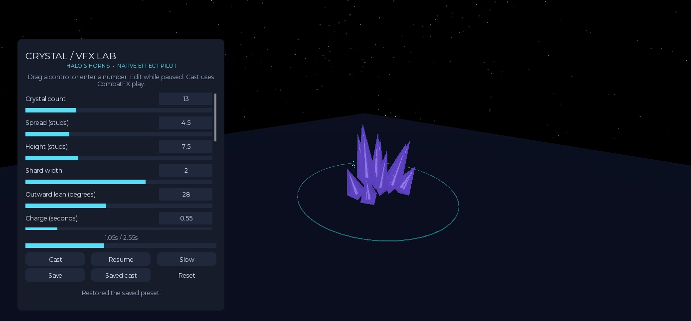

# Crystal VFX Lab

Status: pilot (feature branch; opt-in effect, not assigned to existing attacks).

The standalone Roblox place under `tools/vfx_lab/` previews the exact
`CombatFX.play({ pattern = "impact", vfx = "crystal_eruption" }, { point = position })`
renderer used by Halo & Horns. `st_aoe` accepts the same opt-in `vfx` field. Targeting,
damage, cooldowns and replication remain the caller's responsibility; this is cosmetic.
Existing combat visuals are unchanged until an effect specification selects the preset.

## Run

From the repository root:

```sh
python3 scripts/vfx_lab/serve.py
# In another terminal:
mise exec -- rojo build tools/vfx_lab/lab.project.json --output /tmp/HaloAndHorns-VFX-Lab.rbxl
```

Open the generated place in Studio and press Play. It opens on a paused preview; Cast replays the full effect. The small loopback HTTP server is
needed only for Save. The lab server script is Studio-only and absent from the main
Rojo project. It validates the payload and forwards it to the fixed loopback endpoint;
the Python bridge validates again and atomically writes only the fixed preset path.
No credentials, asset uploads, profile access, or production game server are involved.
Do not connect this lab to the production Rojo server on 34872. Optional lab-only
live sync uses `mise exec -- rojo serve tools/vfx_lab/lab.project.json` on 34873.

- **Cast:** preview the current edits through CombatFX with a Studio-only override.
- **Pause / Slow / timeline:** freeze, slow down, or seek in either direction. Edits
  reshape the paused cast; topology changes rebuild only this cast's geometry.
- **Save:** persist to `configs/vfx/crystal_eruption.lua` in the bridge's checkout.
  The status must report success. Changes are then visible in git for review.
- **Saved cast:** play the saved preset through CombatFX without a preview override.
- **Reset:** restore the most recently saved preset in this session.
- After rebuilding/reopening the place, it starts with the preset saved on disk.

## Ownership and limits

- `configs/vfx/crystal_eruption.lua`: editable art/timing/color preset.
- `configs/vfx/crystal_schema.json`: shared Studio/Python validation bounds.
- `configs/vfx/crystal_style.lua`: facet construction, secondary layers, active budget.
- `configs/vfx/lab.lua`: lab appearance, arena, camera, bridge address.
- `CrystalTimeline`: pure analytic timing and stable normalized shape variation.
- `CrystalEruption`: twelve native corner-wedge facets per crystal, segmented charge/shock ring,
  ballistic glints, one shared heartbeat, explicit/automatic cleanup. No custom shaders,
  mesh IDs, particles, damage, or screen-wide postprocessing in the game renderer.
- Lab-only bloom is authored in lab config; production retains its own lighting.

Eight concurrent casts are retained at most; another cast retires the oldest.
Default preset uses 228 BaseParts (13 × 12 facets + 48 ring segments + 24 glints).
This is an authoring pilot, not a measured mobile performance budget. Test concurrent
casts in the real scene before assigning it to rapid-fire pets/towers. Preview handles
can persist past their end for backward seeking; normal gameplay handles auto-dispose.

The workflow was inspired by
[Elemental Sandbox](https://github.com/achrefelouafi/LinearAbiltyCastingExtendedThreeJS).
The Roblox implementation is independently written; no upstream assets or shaders are copied.

## Verification

- `mise run ci` includes timeline tests (boundaries, ripple, reverse seek, live timing edits,
  deterministic variation, invalid preset rejection).
- `python3 -m unittest discover -s tests -p 'test_vfx_lab_save.py'` checks actual shared-schema
  validation and preservation of the previous file when a save is rejected.
- Native Studio checks cover the rendered composition, paused edits, save/reload,
  CombatFX routing, active cap, and cleanup; record results in the session log.

### Native results — 2026-09-08

Verified in the isolated `HaloAndHorns-VFX-Lab.rbxl` Studio Client.
`tools/vfx_lab/smoke.luau` passed routing, backward seeking, paused height changes,
count rebuild, invalid input, active-cap retirement, and automatic/explicit cleanup.
Actual UI input moved the spread slider from 4.5 to 8.5 studs and Reset restored 4.5.
Save wrote the tuned 13-crystal / 7.5-stud preset to disk; a fresh Play session
loaded those values. Saved cast played through the ordinary facade, and editing
that cast correctly switched back to a preview. Studio Output was empty.


